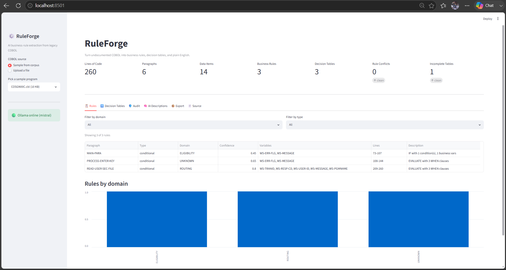
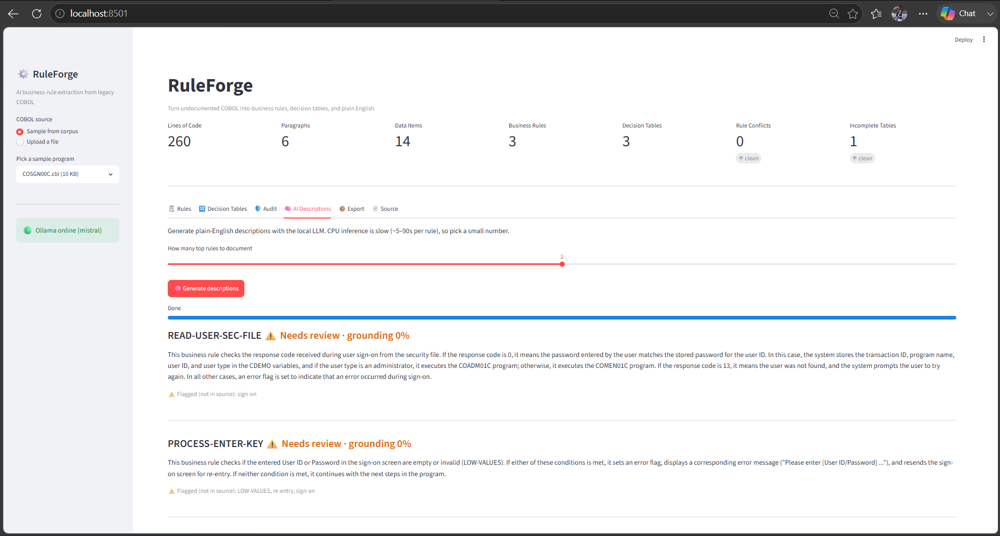
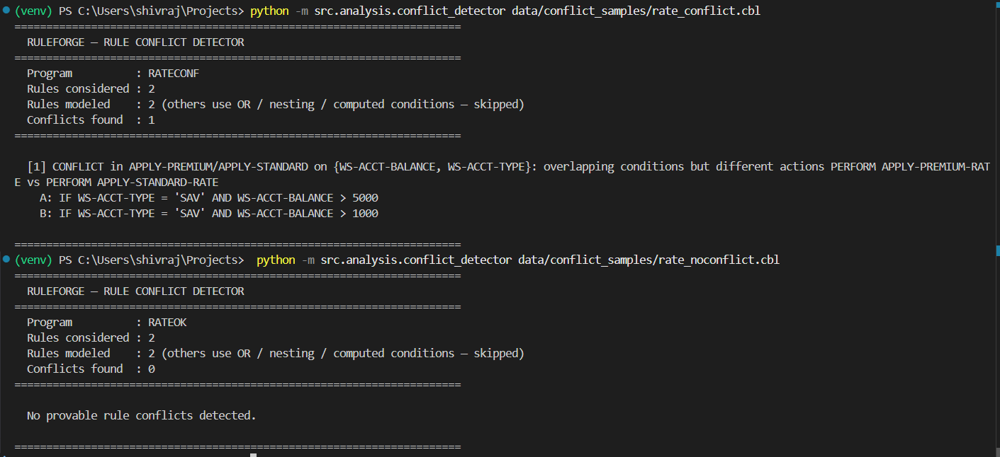
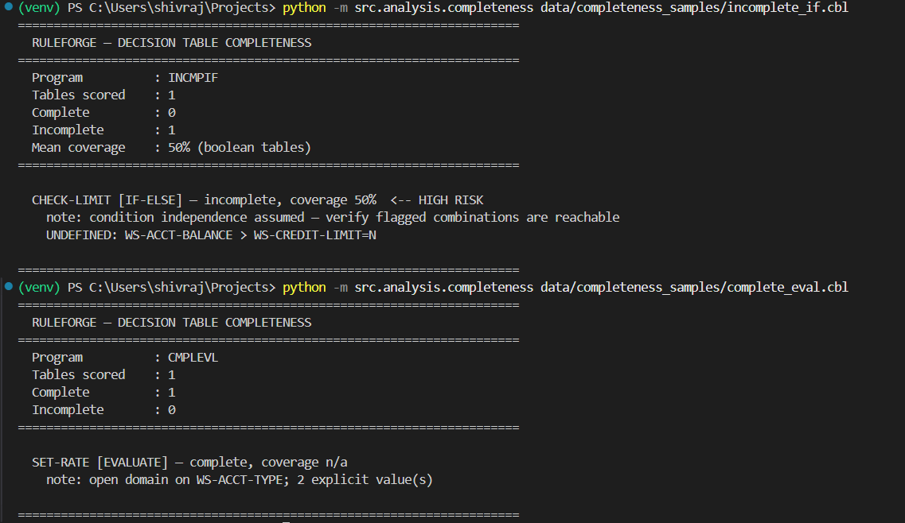
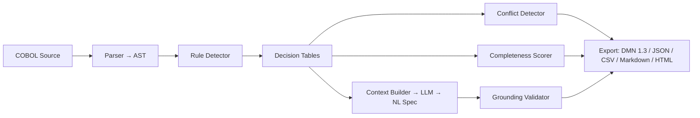

<div align="center">

# 🛠️ RuleForge

### AI-Powered Business Rule Extraction from Legacy COBOL

*Recover the business logic trapped in undocumented mainframe code — as formal decision tables, provable rule-conflict reports, and plain-English specifications generated by a local LLM.*

[](https://github.com/ShivrajRajasekaran/RuleForge/actions/workflows/tests.yml)


</div>

---

## 📸 Screenshots

> _Live Streamlit dashboard running the full pipeline on the AWS CardDemo corpus._

| Pipeline overview | Audit — conflicts & completeness |
|:--:|:--:|
|  |  |

<div align="center">

**AI-generated plain-English specification (local LLM)**



</div>

### ⚡ CLI in action

| Provable rule-conflict detection | Decision-table completeness scoring |
|:--:|:--:|
|  |  |

📄 **See a full reproducible run:** [`examples/audit-report.md`](examples/audit-report.md)

---

## 💡 What It Does

RuleForge reads undocumented COBOL programs and automatically:

1. **Parses** them into an AST (IBM fixed & free format).
2. **Extracts business rules** from nested `IF`/`EVALUATE` logic.
3. **Builds formal decision tables** from those rules.
4. **Proves rule conflicts** — pairs of rules whose conditions provably overlap but whose outcomes differ.
5. **Scores completeness** — flags decision tables with inputs that have *undefined* behaviour.
6. **Generates plain-English specs** with a locally-run LLM (no data leaves your machine), with an anti-hallucination grounding check.
7. **Exports** everything to JSON, DMN 1.3, Markdown, CSV, and HTML.

## 🚩 The Problem

- **800 billion** lines of COBOL run in production globally.
- **~70%** has **no documentation**.
- **75%** of COBOL programmers will have retired by 2030.
- Business rules buried in nested `IF-ELSE` chains are being permanently lost.

## ✨ What Makes It Different

| Capability | RuleForge | Typical COBOL tools |
|---|:--:|:--:|
| Rule → decision-table extraction | ✅ | ✅ |
| **Provable rule-conflict detection** | ✅ | ❌ |
| **Decision-table completeness scoring** | ✅ | ❌ |
| Local LLM docs + anti-hallucination grounding | ✅ | ❌ |
| Runs fully offline, stdlib-only core | ✅ | — |

## 🧱 Architecture



## 📊 Current Status

| Module | Status |
|--------|--------|
| COBOL Parser (AST) | Working — parses IBM fixed & free format (44/44 files) |
| Rule Detector | Working — 531 rules across corpus (overlapping duplicates collapsed) |
| Decision Table Generator | Working — 426 tables generated |
| Rule Conflict Detector | Working — proves overlapping guards with different outcomes (interval/equality reasoning, stdlib-only) |
| Completeness Scorer | Working — enumerates condition combinations, flags undefined inputs (47% of corpus tables incomplete) |
| LLM NL Generator | Working — Ollama/Mistral + anti-hallucination validation |
| Export Engine | Working — JSON, DMN 1.3, Markdown, CSV, HTML (44/44 files) |
| Web Dashboard | Working — Streamlit UI (upload, rules, tables, audit, AI docs, export) |
| Evaluation Framework | Working — corpus metrics + grounding report (44 programs, 531 rules) |
| Accuracy Benchmark | Working — hand-labelled precision / recall (P 90%, R 90%, F1 90% on 5 programs) |
| Test Suite | Working — 90 pytest tests, ~62% coverage |

## 🚀 Quick Start

```bash
# Clone
git clone https://github.com/ShivrajRajasekaran/RuleForge.git
cd RuleForge

# Setup
python -m venv venv
source venv/bin/activate            # Windows: venv\Scripts\activate
pip install -r requirements.txt

# Download test data (AWS CardDemo COBOL corpus)
git clone https://github.com/aws-samples/aws-mainframe-modernization-carddemo data/cobol_corpus/aws_card_demo
```

### Run the pipeline (each module runs standalone)

```bash
python -m src.parser.cobol_parser <file.cbl>          # Parse → AST
python -m src.extraction.rule_detector <file.cbl>     # Detect business rules
python -m src.extraction.decision_table <file.cbl>    # Build decision tables
```

### Audit: conflicts & completeness

```bash
# Detect contradictory business rules (overlapping conditions, different outcomes)
python -m src.analysis.conflict_detector data/conflict_samples/rate_conflict.cbl   # 1 conflict
python -m src.analysis.conflict_detector data/conflict_samples/rate_noconflict.cbl # 0 (control)

# Score decision-table completeness (flag inputs with undefined behaviour)
python -m src.analysis.completeness data/completeness_samples/incomplete_if.cbl    # 50%, HIGH RISK
python -m src.analysis.completeness data/completeness_samples/complete_eval.cbl    # complete
```

### Plain-English docs with a local LLM (needs Ollama)

```bash
ollama pull mistral
python -m src.generation.llm_client                   # Health check
python -m src.generation.nl_generator <file.cbl> 3    # Document top 3 rules
```

### Export, dashboard, evaluation

```bash
# Export everything → exports/
python -m src.export.export_engine <file.cbl>             # without LLM (fast)
python -m src.export.export_engine <file.cbl> --with-llm 3 # include LLM docs

# Web dashboard (browser UI for the whole pipeline)
streamlit run src/dashboard/app.py

# Corpus metrics → evaluation/REPORT.md + summary.json + per_file.csv
python -m src.analysis.evaluator                  # metrics only (fast)
python -m src.analysis.evaluator --llm-sample 3   # + grounding sample (slow)

# Detection accuracy vs hand-labelled benchmark → evaluation/ground_truth/REPORT.md
python -m src.analysis.ground_truth
```

### Tests

```bash
pytest                       # 90 tests, no Ollama/corpus needed (all mocked)
pytest --cov=src             # with coverage report
```

## 🧰 Tech Stack

**Python 3.11+** (stdlib-only core: regex COBOL parser + `urllib`-based LLM client, no heavy deps) · **Ollama** (Mistral 7B, local) · **Streamlit + pandas** (dashboard) · **pytest** (tests)

## ⚠️ Limitations (honest scope)

This is a **research prototype (v0.1)**, not a production modernization suite. Known limits:

- **Regex parser**, not a full grammar — robust on the AWS CardDemo corpus, but will choke on heavily macro'd / `COPY`-heavy / non-standard COBOL.
- **Conflict detector** only models rules with simple interval/equality guards. On the corpus, ~40 of 531 rules were modelable; the rest (OR, nesting, computed, var-to-var) are reported as *undetermined* rather than guessed — **precision over recall by design**.
- **Completeness scorer** assumes condition independence, so it **over-reports** (never under-reports) incompleteness.
- **Benchmark** is hand-labelled on **5 programs** (P/R/F1 = 90/90/90) — indicative, not a large-scale claim.
- No inter-program dataflow / `COPY` resolution yet. Analysis is **offline/batch**, not real-time streaming.

## 📄 License

MIT
